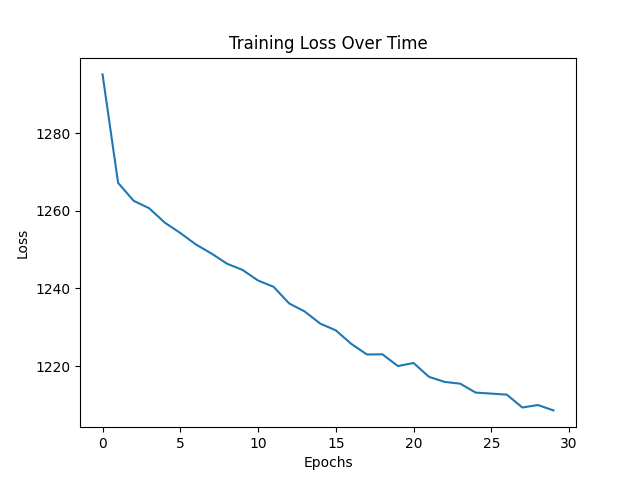

# Madness-Predictor


A neural network system that predicts NCAA March Madness tournament outcomes using per-possession basketball metrics computed on a quarterly basis.

**Authors:** [Xavier Briggs](https://linkedin.com/in/xavierbriggs05) | [George Kyrollos](https://www.linkedin.com/in/george-kyrollos-744047286/) | [Andre Mayard](https://www.linkedin.com/in/andre-mayard-907876285/)
*Notre Dame SAC MBB*

---

## 2026 Bracket Predictions

**Predicted Champion: Duke** (defeated Florida in the final, 99.99% confidence)

### Final Four & Championship

| Round | Matchup | Winner | Confidence |
|-------|---------|--------|------------|
| Final Four | Duke vs. Michigan | **Duke** | 99.99% |
| Final Four | Florida vs. Arizona | **Florida** | 99.99% |
| Championship | Duke vs. Florida | **Duke** | 99.99% |

### Elite Eight

| Matchup | Winner | Confidence |
|---------|--------|------------|
| Duke vs. Michigan St | **Duke** | 99.99% |
| Michigan vs. Tennessee | **Michigan** | 72.4% |
| Florida vs. North Carolina | **Florida** | 99.99% |
| Arizona vs. Gonzaga | **Arizona** | 99.9% |

<details>
<summary><strong>Sweet Sixteen</strong></summary>

| Matchup | Winner | Confidence |
|---------|--------|------------|
| Duke vs. St John's | **Duke** | 99.99% |
| Michigan St vs. UCLA | **Michigan St** | 99.99% |
| Michigan vs. Texas Tech | **Michigan** | 99.9% |
| Tennessee vs. Kentucky | **Tennessee** | 76.0% |
| Florida vs. Vanderbilt | **Florida** | 99.99% |
| North Carolina vs. St Mary's CA | **North Carolina** | 79.0% |
| Arizona vs. Wisconsin | **Arizona** | 99.9% |
| Gonzaga vs. Missouri | **Gonzaga** | 85.0% |

</details>

<details>
<summary><strong>Round of 32</strong></summary>

| Matchup | Winner | Confidence |
|---------|--------|------------|
| Duke vs. Ohio St | **Duke** | 99.7% |
| St John's vs. Cal Baptist | **St John's** | 99.97% |
| Louisville vs. Michigan St | **Michigan St** | 81.0% |
| UCLA vs. Connecticut | **UCLA** | 83.4% |
| Michigan vs. Georgia | **Michigan** | 99.99% |
| Texas Tech vs. Alabama | **Texas Tech** | 99.0% |
| Tennessee vs. Virginia | **Tennessee** | 99.99% |
| Kentucky vs. Iowa St | **Kentucky** | 87.0% |
| Florida vs. Clemson | **Florida** | 99.99% |
| Vanderbilt vs. Nebraska | **Vanderbilt** | 99.6% |
| North Carolina vs. Illinois | **North Carolina** | 71.6% |
| St Mary's CA vs. Houston | **St Mary's CA** | 93.0% |
| Arizona vs. Villanova | **Arizona** | 98.9% |
| Wisconsin vs. Arkansas | **Wisconsin** | 99.5% |
| BYU vs. Gonzaga | **Gonzaga** | 54.1% |
| Missouri vs. Purdue | **Missouri** | 72.2% |

</details>

<details>
<summary><strong>Round of 64</strong></summary>

| Matchup | Winner | Confidence |
|---------|--------|------------|
| Duke vs. Siena | **Duke** | 99.99% |
| Ohio St vs. TCU | **Ohio St** | 97.8% |
| St John's vs. Northern Iowa | **St John's** | 99.99% |
| Kansas vs. Cal Baptist | **Cal Baptist** | 71.3% |
| Louisville vs. South Florida | **Louisville** | 92.7% |
| Michigan St vs. N Dakota St | **Michigan St** | 99.99% |
| UCLA vs. UCF | **UCLA** | 99.98% |
| Connecticut vs. Furman | **Connecticut** | 99.99% |
| Michigan vs. Howard | **Michigan** | 99.99% |
| Georgia vs. St Louis | **Georgia** | 99.99% |
| Texas Tech vs. Akron | **Texas Tech** | 99.99% |
| Alabama vs. Hofstra | **Alabama** | 99.99% |
| Tennessee vs. SMU | **Tennessee** | 99.99% |
| Virginia vs. Wright St | **Virginia** | 99.99% |
| Kentucky vs. Santa Clara | **Kentucky** | 99.99% |
| Iowa St vs. Tennessee St | **Iowa St** | 99.99% |
| Florida vs. Lehigh | **Florida** | 99.99% |
| Clemson vs. Iowa | **Clemson** | 99.9% |
| Vanderbilt vs. McNeese St | **Vanderbilt** | 99.99% |
| Nebraska vs. Troy | **Nebraska** | 99.96% |
| North Carolina vs. VCU | **North Carolina** | 99.6% |
| Illinois vs. Penn | **Illinois** | 99.99% |
| St Mary's CA vs. Texas A&M | **St Mary's CA** | 99.99% |
| Houston vs. Idaho | **Houston** | 81.0% |
| Arizona vs. LIU Brooklyn | **Arizona** | 99.99% |
| Villanova vs. Utah St | **Villanova** | 99.5% |
| Wisconsin vs. High Point | **Wisconsin** | 99.99% |
| Arkansas vs. Hawaii | **Arkansas** | 100.0% |
| BYU vs. NC State | **BYU** | 62.1% |
| Gonzaga vs. Kennesaw | **Gonzaga** | 99.99% |
| Miami FL vs. Missouri | **Missouri** | 67.0% |
| Purdue vs. Queens NC | **Purdue** | 99.99% |

</details>

---

## 2025 Bracket Predictions

**Predicted Champion: Auburn** (defeated Duke in the final, 76.0% confidence)

*Actual 2025 Champion: Florida. The model correctly had Florida in the Final Four but favored Auburn overall.*

### Final Four & Championship

| Round | Matchup | Winner | Confidence |
|-------|---------|--------|------------|
| Final Four | Auburn vs. Florida | **Auburn** | 99.3% |
| Final Four | Duke vs. Tennessee | **Duke** | 93.7% |
| Championship | Auburn vs. Duke | **Auburn** | 76.0% |

### Elite Eight

| Matchup | Winner | Confidence |
|---------|--------|------------|
| Auburn vs. North Carolina | **Auburn** | 83.3% |
| Florida vs. St. John's | **Florida** | 99.9% |
| Duke vs. Alabama | **Duke** | 99.9% |
| Tennessee vs. Purdue | **Tennessee** | 75.7% |

<details>
<summary><strong>Sweet Sixteen</strong></summary>

| Matchup | Winner | Confidence |
|---------|--------|------------|
| Auburn vs. Texas A&M | **Auburn** | 99.1% |
| New Mexico vs. North Carolina | **North Carolina** | 83.0% |
| Florida vs. Maryland | **Florida** | 99.7% |
| St. John's vs. Texas Tech | **St. John's** | 92.0% |
| Duke vs. Arizona | **Duke** | 99.9% |
| Alabama vs. Wisconsin | **Alabama** | 99.8% |
| Purdue vs. Gonzaga | **Purdue** | 89.1% |
| Tennessee vs. Kentucky | **Tennessee** | 61.1% |

</details>

<details>
<summary><strong>Round of 32</strong></summary>

| Matchup | Winner | Confidence |
|---------|--------|------------|
| Auburn vs. Louisville | **Auburn** | 97.1% |
| Michigan vs. Texas A&M | **Texas A&M** | 73.4% |
| Iowa St vs. North Carolina | **North Carolina** | 80.9% |
| Michigan St. vs. New Mexico | **New Mexico** | 92.1% |
| Florida vs. Connecticut | **Florida** | 99.2% |
| Maryland vs. Memphis | **Maryland** | 96.5% |
| Texas Tech vs. Missouri | **Texas Tech** | 94.0% |
| St. John's vs. Arkansas | **St. John's** | 63.1% |
| Duke vs. Mississippi St. | **Duke** | 99.9% |
| Arizona vs. Oregon | **Arizona** | 93.1% |
| Wisconsin vs. BYU | **Wisconsin** | 52.3% |
| Alabama vs. Saint Mary's | **Alabama** | 98.2% |
| Houston vs. Gonzaga | **Gonzaga** | 75.7% |
| Purdue vs. Clemson | **Purdue** | 76.9% |
| Kentucky vs. Illinois | **Kentucky** | 55.6% |
| Tennessee vs. UCLA | **Tennessee** | 99.6% |

</details>

<details>
<summary><strong>Round of 64</strong></summary>

| Matchup | Winner | Confidence |
|---------|--------|------------|
| Auburn vs. Alabama St | **Auburn** | 99.99% |
| Louisville vs. Creighton | **Louisville** | 81.0% |
| Michigan vs. UC San Diego | **Michigan** | 79.0% |
| Texas A&M vs. Yale | **Texas A&M** | 96.5% |
| Mississippi vs. North Carolina | **North Carolina** | 98.3% |
| Iowa St vs. Lipscomb | **Iowa St** | 56.7% |
| Marquette vs. New Mexico | **New Mexico** | 94.6% |
| Michigan St vs. Bryant | **Michigan St** | 99.9% |
| Florida vs. Norfolk St | **Florida** | 99.97% |
| Connecticut vs. Oklahoma | **Connecticut** | 83.4% |
| Memphis vs. Colorado St | **Memphis** | 99.6% |
| Maryland vs. Grand Canyon | **Maryland** | 99.7% |
| Missouri vs. Drake | **Missouri** | 99.98% |
| Texas Tech vs. UNC Wilmington | **Texas Tech** | 99.7% |
| Kansas vs. Arkansas | **Arkansas** | 68.9% |
| St John's vs. NE Omaha | **St John's** | 99.4% |
| Duke vs. American University | **Duke** | 99.99% |
| Mississippi St vs. Baylor | **Mississippi St** | 99.4% |
| Oregon vs. Liberty | **Oregon** | 99.8% |
| Arizona vs. Akron | **Arizona** | 99.8% |
| BYU vs. VCU | **BYU** | 99.3% |
| Wisconsin vs. Montana | **Wisconsin** | 99.7% |
| Saint Mary's vs. Vanderbilt | **Saint Mary's** | 67.5% |
| Alabama vs. Robert Morris | **Alabama** | 99.9% |
| Houston vs. SIUE | **Houston** | 99.1% |
| Gonzaga vs. Georgia | **Gonzaga** | 99.96% |
| Clemson vs. McNeese St | **Clemson** | 99.8% |
| Purdue vs. High Point | **Purdue** | 99.9% |
| Illinois vs. Texas | **Illinois** | 65.5% |
| Kentucky vs. Troy | **Kentucky** | 99.6% |
| UCLA vs. Utah St | **UCLA** | 79.2% |
| Tennessee vs. Wofford | **Tennessee** | 99.6% |

</details>

---

## Architecture

```
data/raw/*.csv                  Kaggle NCAA datasets + 2026 season data
       |
       v
data/process_quarter_data.py    Compute per-team, per-quarter advanced metrics
       |
       v
data/processed/teams.csv        Team feature matrix (14 metrics x 4 quarters)
       |
       v
data/generate_training_data.py  Pair teams from historical matchups -> train/test split
       |
       v
models/model.py                 3-layer NN (16-16-16) with softmax -> win probabilities
       |
       v
src/predictor.py                Load model, predict each round's matchups
       |
       v
src/generate_rr.py              Advance winners, build next round's bracket
       |
       v
src/predictions/round*_.csv     Final per-round predictions with confidence scores
```

## Features

The model uses 14 per-possession basketball metrics computed quarterly:

| Metric | Description |
|--------|-------------|
| TS% | True Shooting Percentage |
| eFG% | Effective Field Goal Percentage |
| TO% | Turnover Percentage |
| OREB% | Offensive Rebound Percentage |
| DREB% | Defensive Rebound Percentage |
| FTR | Free Throw Rate |
| 3PAr | Three-Point Attempt Rate |
| AST/TO | Assist to Turnover Ratio |
| STL% | Steal Percentage |
| BLK% | Block Percentage |
| PPP | Points Per Possession |
| AdjO | Adjusted Offensive Rating |
| AdjD | Adjusted Defensive Rating |

Each matchup input is a 26-dimensional vector (13 metrics x 2 teams).

## Quick Start

```bash
git clone https://github.com/XavierBriggs/Madness-Predictor.git
cd Madness-Predictor
pip install -r requirements.txt
```

### Run the full pipeline

```bash
make all        # process data -> train model -> predict all rounds
```

### Or step by step

```bash
make data       # process raw CSVs into team feature matrix + training data
make train      # train the neural network
make predict    # predict rounds 1-6
```

## Model Performance

The model achieves ~70-75% accuracy on historical NCAA tournament matchups using cross-entropy loss with the Adam optimizer (30 epochs, lr=0.0005, batch size=32).



## License

[MIT](LICENSE)

## Contact

- Xavier Briggs -- xbriggs@nd.edu -- [LinkedIn](https://linkedin.com/in/xavierbriggs05)
- George Kyrollos -- gkyrollo@nd.edu -- [LinkedIn](https://www.linkedin.com/in/george-kyrollos-744047286/)
- Andre Mayard -- amayard@nd.edu -- [LinkedIn](https://www.linkedin.com/in/andre-mayard-907876285/)
